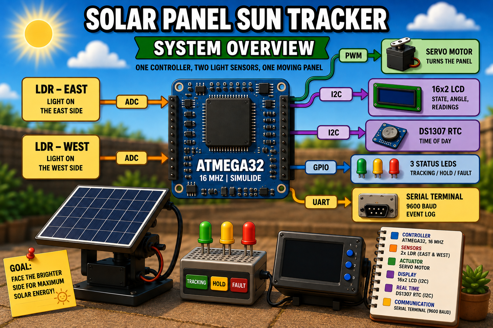

<p align="center">
  
  
  
  
</p>

# Solar Panel Sun Tracker (SPST)

<p align="center">
  
</p>

Solar Panel Sun Tracker (SPST) is an embedded systems project developed for the **Digital Egypt Cubs Initiative (DECI) – Embedded Systems Level 5**.

The project simulates an automated solar panel sun tracker using an **ATmega32** microcontroller and **SimulIDE**. The system uses two LDR sensors to determine the direction of stronger light and controls a servo motor to orient the solar panel accordingly.

The project will progressively evolve from basic sensor-based tracking into a complete embedded application with time-based parking, cloud detection, fault handling, system monitoring, and FreeRTOS-based control.

## Features

- Servo-based panel positioning
- Configurable servo travel limits
- EEPROM-based configuration parameters
- Automatic night parking
- Cloud detection and hold behavior
- Sensor fault detection
- UART system logging (9600 baud)
- Status LED indication
- FreeRTOS-based architecture
- SimulIDE simulation support

---

## Documentation

Detailed documentation is organized under the `docs/` directory.

### Circuit Documentation

The circuit documentation contains the ATmega32 peripheral allocation, hardware architecture, design decisions, and detailed connection mapping.

**[→ Circuit Documentation](./docs/circuit/README.md)**

### Software Architecture

The software documentation describes the software architecture, source-code organization, MCAL and HAL layers, application logic, initialization sequence, runtime data flow, and development strategy.

**[→ Software Architecture Documentation](./docs/software/README.md)**

---

## Prerequisites

Install the following tools before building:

- AVR-GCC Toolchain
- CMake
- SimulIDE v1.1

---

## Getting Started

### Option 1: One-command clone (recommended)

```bash
git clone --recurse-submodules="src/lib/FreeRTOS" --shallow-submodules https://github.com/sief-ali/spst
cd spst
```

This initializes only the project FreeRTOS submodule and uses shallow history
for it, avoiding the full FreeRTOS history download.

### Option 2: Initialize the submodule after a normal clone

If you already cloned the project without submodules, run:

```bash
# Move into the project directory.
cd spst

# Initialize only the first-level FreeRTOS submodule with shallow history.
git submodule update --init --depth=1 src/lib/FreeRTOS
```

To update an existing checkout of the main repository:

```bash
git pull origin master
```

---

## Building the Project

Configure the project:

```bash
cmake \
    -B build \
    -DCMAKE_TOOLCHAIN_FILE=cmake/toolchains/avr-gcc.cmake
```

Build the firmware:

```bash
cmake --build build
```

The generated firmware will be located at:

```text
build/src/spst.hex
```

---

## Running the Simulation

1. Launch **SimulIDE**.
2. Open the project:

```text
simulide/main.sim1
```

3. Load the generated firmware:

```text
build/src/spst.hex
```

4. Start the simulation.

---

## Project Structure

```text
.
├── src/
│   ├── app/             # Tracker behavior, FSM, and FreeRTOS tasks
│   ├── board/           # Board pins and shared board objects
│   ├── HAL/             # Device-facing abstractions
│   ├── MCAL/            # ATmega32 register-level drivers
│   ├── lib/FreeRTOS/    # FreeRTOS Git submodule
│   └── utils/
├── cmake/
├── docs/
├── simulide/
└── CMakeLists.txt
```

---

## Next and related documentation

- [Software documentation](docs/software/README.md) — application architecture,
  FreeRTOS tasks, and supporting layers.
- [Circuit documentation](docs/circuit/README.md) — peripheral allocation and
  wiring requirements.
- [Detailed circuit connections](docs/circuit/connections.md) — pin-by-pin
  connection map.
