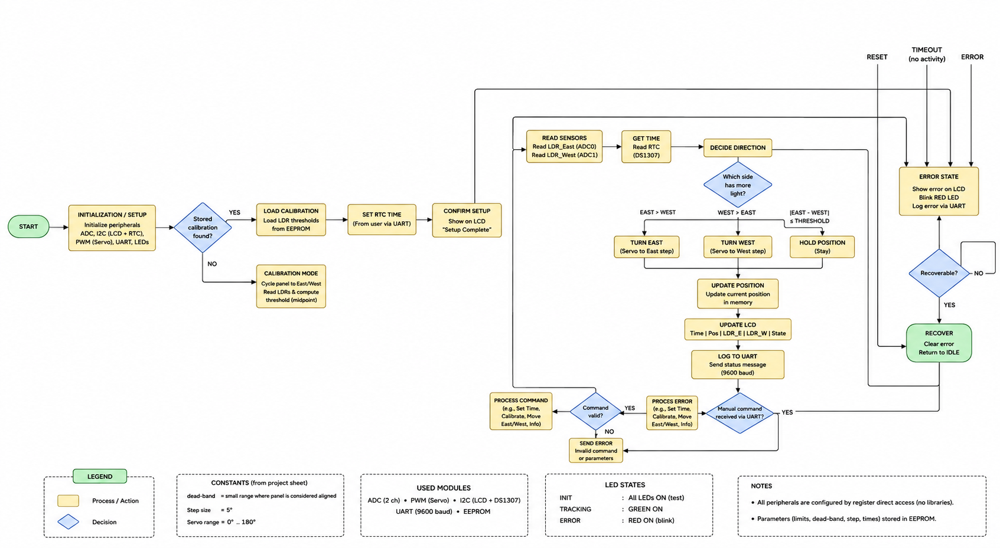
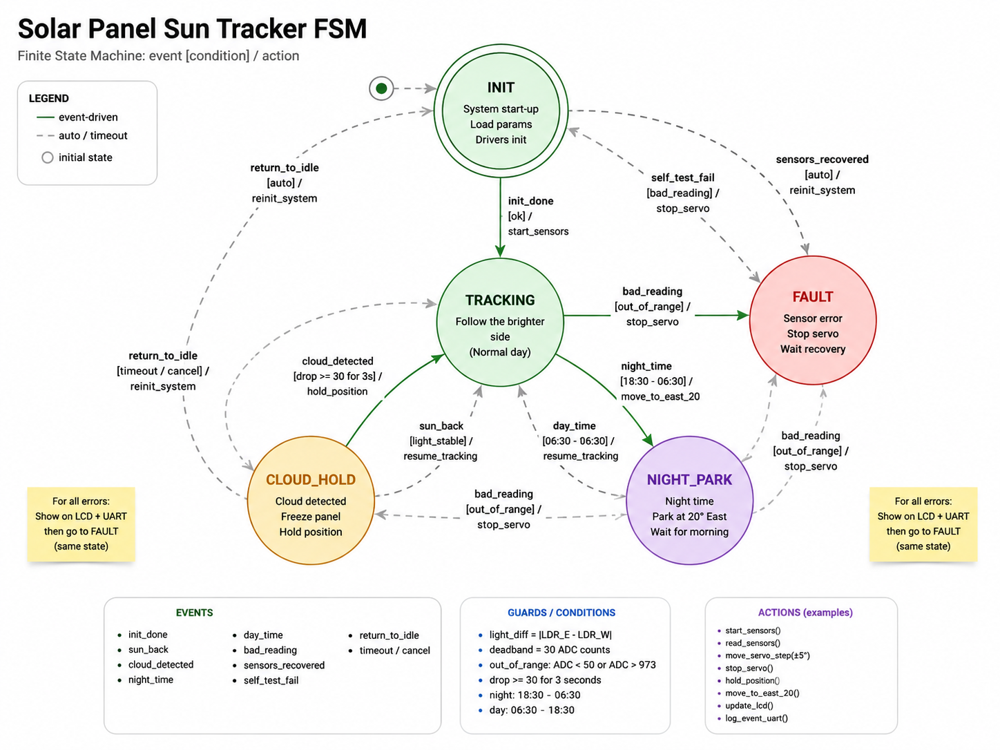

# SPST Software Architecture

This document describes the software architecture, source-code organization,
hardware abstraction layers, application logic, initialization sequence,
and runtime behavior of the Solar Panel Sun Tracker (SPST).

The software is developed incrementally. Each layer is implemented and
verified before higher-level application logic is introduced.

---

## 1. Purpose

The software is responsible for controlling the SPST hardware using the
ATmega32.

The implementation is divided into hardware-dependent layers and
application-level logic so that hardware drivers remain independent from
project behavior.

The final system will progressively evolve from a bare-metal implementation
into a FreeRTOS-based application.

---

## 2. Software Architecture

The software is organized into three main layers:

```text
┌──────────────────────────────────────┐
│            Application               │
│                                      │
│     Tracking / FSM / Business Logic  │
└──────────────────┬───────────────────┘
                   │
                   ▼
┌──────────────────────────────────────┐
│                HAL                   │
│                                      │
│       LCD / Servo / RTC / LDR / ...  │
└──────────────────┬───────────────────┘
                   │
                   ▼
┌──────────────────────────────────────┐
│               MCAL                   │
│                                      │
│     GPIO / ADC / PWM / TWI / UART    │
└──────────────────┬───────────────────┘
                   │
                   ▼
┌──────────────────────────────────────┐
│              ATmega32                │
└──────────────────────────────────────┘
````

The intended dependency direction is:

```text
Application
     ↓
    HAL
     ↓
   MCAL
     ↓
 Hardware
```

Higher-level layers may depend on lower-level layers, but lower-level layers
must not depend on higher-level application logic.

---

## 3. Project Structure

The software documentation is maintained under `docs/software/`.

The source code is organized around the MCAL, HAL, and application layers.

```text
spst-project/
├── CMakeLists.txt
├── README.md
│
├── cmake/
│
├── docs/
│   ├── circuit/
│   │   ├── README.md
│   │   └── connections.md
│   │
│   └── software/
│       └── README.md
│
├── src/
│   ├── mcal/
│   ├── hal/
│   └── app/
│
├── include/
│
└── ...
```

The structure will evolve as additional drivers and application modules are
implemented.

---

## 4. Layer Responsibilities

### 4.1 MCAL

The Microcontroller Abstraction Layer (MCAL) provides direct access to the
ATmega32 hardware peripherals.

```text
MCAL
  ↓
ATmega32 hardware
```

Expected MCAL modules include:

```text
GPIO
ADC
Timer / PWM
UART
TWI / I²C
EEPROM
```

MCAL is responsible for:

* ATmega32 peripheral configuration
* Register-level hardware access
* Interrupt configuration and handling
* Hardware-specific peripheral operations

MCAL must not contain SPST application or business logic.

---

### 4.2 HAL

The Hardware Abstraction Layer (HAL) combines MCAL functionality into
hardware-oriented interfaces used by the application.

Expected HAL modules include:

```text
HAL Servo
HAL LDR
HAL LCD
HAL RTC
```

The HAL provides interfaces that represent hardware functionality without
requiring the application to directly manipulate ATmega32 registers.

For example:

```c
Servo_SetAngle(90);
```

is a HAL-level operation, while direct Timer1 register manipulation belongs
to MCAL.

---

### 4.3 Application

The application layer contains the behavior and decision-making logic of
the Solar Panel Sun Tracker.

The application will eventually contain:

```text
Application
│
├── Sensor processing
├── Tracking logic
├── Cloud detection
├── Night parking
├── Fault handling
├── FSM
├── Configuration
└── System coordination
```

The application must not directly depend on ATmega32 register details.

---

## 5. Dependency Rules

The allowed dependency direction is:

```text
APP → HAL → MCAL → Hardware
```

The following dependencies are not allowed:

```text
MCAL → HAL
MCAL → APP
HAL  → APP
```

Lower layers must not depend on higher-level application logic.

Business logic must not depend directly on ATmega32 register details.

This separation allows hardware drivers to be tested independently and
keeps application behavior independent from the underlying MCU
implementation.

---

## 6. Hardware Initialization

The system initialization sequence will be developed incrementally.

The intended high-level sequence is:

```text
Reset
  ↓
MCU initialization
  ↓
MCAL initialization
  ↓
HAL initialization
  ↓
Application initialization
  ↓
Main application
```

The exact initialization order will be documented as the individual
peripherals and drivers are implemented and verified.

---

## 7. Application Initialization

Application initialization is responsible for preparing the SPST software
before normal operation begins.

The initialization stage will eventually include:

```text
Configuration loading
        ↓
Sensor initialization
        ↓
Actuator initialization
        ↓
RTC initialization
        ↓
Display initialization
        ↓
Initial system state
```

The exact sequence and responsibilities will be updated as the application
is implemented.

---

## 8. Business Logic

<p align="center">
  
</p>

The application layer contains the SPST control logic.

The final system will include functionality such as:

* Light-based tracking
* Servo travel limits
* Dead-band handling
* Cloud detection
* Night parking
* Sensor fault handling
* Configuration management
* System state management

The business logic will be implemented independently from the low-level
ATmega32 peripheral drivers.

---

## 9. Runtime Data Flow

The basic runtime data flow is:

```text
East LDR ─┐
          ├──► Sensor HAL ──► Application
West LDR ─┘                         │
                                   │
                                   ▼
                              Tracking Logic
                                   │
                                   ▼
                              Servo HAL
                                   │
                                   ▼
                                Servo
```

Other system peripherals will integrate into the application as their
drivers are implemented:

```text
RTC  ──► RTC HAL  ──► Application
LCD  ◄── LCD HAL  ◄── Application
LEDs ◄── GPIO HAL ◄── Application
UART ◄── UART HAL ◄── Application
```

The runtime data flow will be expanded as additional system functionality
is implemented.

---

## 10. State Machine

<p align="center">
  
</p>

The final SPST application will use a finite state machine (FSM) to
coordinate the major operating modes of the system.

The state definitions, transition conditions, priorities, and actions will
be documented here as the FSM is designed and implemented.

Initial state-machine documentation will be added after the basic hardware
and sensor control layers have been verified.

---

## 11. RTOS Architecture

The project will initially be developed and verified using a bare-metal
architecture.

FreeRTOS will be introduced after the underlying hardware drivers and
application functionality have been tested.

The final RTOS architecture is expected to separate system responsibilities
into independent tasks.

The planned architecture may include:

```text
Sensor Task
     │
     ▼
 Sensor Data
     │
     ▼
Control Task
     │
     ├──► Tracking / FSM
     └──► Servo

Display Task
     │
     ├──► LCD
     └──► UART
```

The actual task structure, synchronization mechanisms, queues, and timing
requirements will be documented when the RTOS implementation begins.

---

## 12. Configuration and Parameters

The SPST application contains configurable parameters that affect system
behavior.

Examples include:

```text
Dead-band
Minimum servo angle
Maximum servo angle
Night parking angle
Cloud detection timing
Day/night operating times
```

Configuration storage will use the ATmega32 internal EEPROM where required.

The application will access configuration through an abstraction rather than
directly manipulating EEPROM registers.

The final parameter values and storage format will be documented when the
configuration system is implemented.

---

## 13. Error Handling

The system will detect and handle hardware and operating conditions that
prevent normal tracking.

Expected fault conditions include:

```text
Sensor fault
Invalid sensor readings
RTC failure
Servo/control failure
Other hardware initialization failures
```

The exact fault states, detection rules, recovery behavior, and user
indications will be documented as the fault-handling system is implemented.
